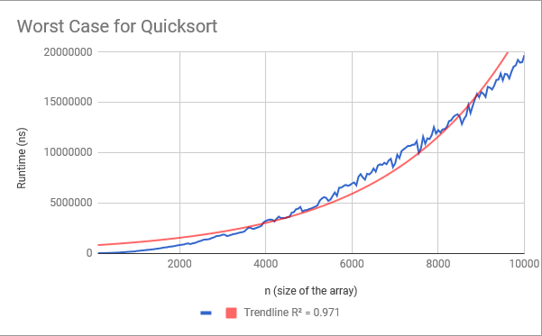

#### Team EquipoNumeroUno (Roster: Ahnaf Hasan, Colin Hosking, Aidan Griffin)
#### APCS02 pd08
#### Lab1
#### 2018-03-14

# Lab1: Assessing the Runtime of Quicksort

## Hypothesis
We think the runtime of quicksort is O(nlogn) because the algorithm will move the pivot logn times (much like binary sort). Each time there is a new pivot, partition is executed, which is O(n). Hence the runtime of O(nlogn).

## Background
Quicksort Overview:
The quicksort algorithm runs through the array provided by continuously dividing the array in half until it reaches the base of an array with length of 1. While dividing the array, it makes a "wall" that seperates between the sorted and unsorted array at each of the extremes. A pivot point, given as the element at the end of the right "wall", is used as a divider. All that are less than the selected pivot is sent to the left while the ones that are equal to or greater than the pivot are on the left side. This causes a runtime of **O(nlogn)** because the pivot is moved down the entire length of the array and causes the array to be cut in half at each element, thus **n** elements causing a runtime of **logn**.

## Methodology
We begin by initiating a test array of length 100, and it is populated (see below). The array is shuffled, and the StartTime is recorded. Quicksort is immidiately executed, and after it terminates, the total runtime is calculated by subtracting the StartTime with the current time. This runtime is added to a running sum of runtimes. The array is reshuffled, and the process repeats 1000 times. The average runtime is then calculated, and written into a file. Then the array length is increased by 50, and the entire process starts over again. This continues until the array length exceeds 10000.

To test the average case, arrays are shuffled before each execution of quicksort, and arrays are populated with random numbers.
To test the worst case, arrays are not shuffled and are populated with numbers 0 - length-1.
To test an array with all the same number, you populate the array with a predetermined constant.

## Quicksort Runtime Cases
### Best Case Senario
The best case senario is if the array is made of only one unique integer, causing the algorigthm to not have to sort it since it is already sorted. This means that runtime is still **O(nlogn)** since there isn't a "exit-early" method as that would cause runtime to increase by a very noticeable amount.
### Average Case Senario
This case depends on the array being shuffled everytime after being sorted. This causes the array to have different values as the pivot, which can be the smallest number, the largest number, or simply an in-between number. This means that the runtime simply goes to being **O(nlogn)**.
### Worst Case Senario
The worst case is if the whole array is already sorted in descending order since the algorithmn would cause the pivot point being the smallest element. This means that the partitioning of the array would make it into an array of *1* and *n - 1*. This inflates the runtime to **O(n^2)**.

Average Case Scenario Graph:

Worst Case Scenario Graph:
